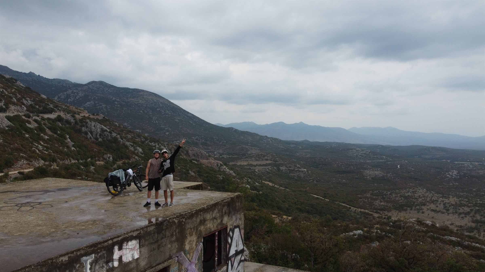

# Sedmo Nebo: Road to Istanbul

[sedmonebo.com](https://sedmonebo.com) is a live Croatian travel diary for Marin and Marko's bicycle journey from Dubrovnik to Istanbul. It combines an interactive GPX map, daily photo recaps, live location updates, a humanitarian campaign for SOS Children's Village Croatia, public comments, and a collaborative wall of support. 



## Highlights

- Interactive Leaflet map with the planned GPX route and completed-route progress
- Mobile-first daily recap navigator with photo galleries and comments
- Live location and event pins managed from the road
- Anonymous emoji reactions and draggable 24-hour sticky notes
- OpenAI-assisted moderation for public comments and drawings
- Protected mobile admin for recaps, GPS, pins, images, settings, and moderation
- Supabase database, Auth, Row Level Security, and Storage
- SEO metadata, Open Graph data, sitemap, robots rules, and structured data

## Stack

- Next.js 15 and React 19
- TypeScript and Tailwind CSS
- Supabase Postgres, Auth, and Storage
- Leaflet and OpenStreetMap-compatible map tiles
- OpenAI Moderation API
- Vercel deployment

## Local Development

```bash
npm install
npm run dev
```

Open `http://localhost:3000`. The admin login is available at `http://localhost:3000/admin/login`.

Create `.env.local` from `.env.example` and provide credentials for the Supabase project and OpenAI moderation. Never expose the service-role key in client code or commit `.env.local`.

```env
NEXT_PUBLIC_SUPABASE_URL=
NEXT_PUBLIC_SUPABASE_ANON_KEY=
SUPABASE_SERVICE_ROLE_KEY=
OPENAI_API_KEY=
ALLOWED_ADMIN_EMAILS=
```

Apply the SQL files from `supabase/migrations` in numeric order when creating a new Supabase project.

## Quality Checks

```bash
npm run typecheck
npm run lint
npm run build
```

## Documentation

- [Project setup](docs/setup.md)
- [Admin guide](docs/admin-guide.md)
- [Architecture](docs/architecture.md)
- [Deployment](docs/deployment.md)

## Repository Notes

Runtime assets live in `public/assets`, database migrations in `supabase/migrations`, and application code in `app` and `src`. Production content is managed through Supabase and the protected admin panel rather than committed to Git.

This repository is maintained for the Sedmo Nebo project. No license is granted for reuse of its branding, photography, or written content.
